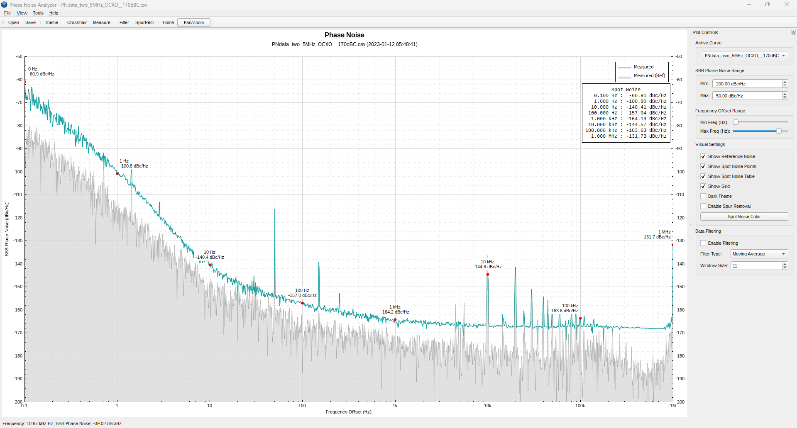

# pna_qt Phase Noise Analyzer (C++/Qt)

A desktop application built with C++ and Qt 5.15+ up to Qt6.9+ for visualizing and analyzing phase noise data from CSV files.

It is fully tested and compatible with native csv files from the amazing PN2060C Phase Noise Analyzer https://qsl.net/bg6khc/pn2060c_phase_noise_analyzer.htm




## Features

* **Load Multiple CSV Files:** Load and visually compare phase noise data from one or more CSV files.
  * Each file is plotted as a separate trace with a distinct color.
  * Optional reference noise data (if present in the 3rd column) is also plotted.
* **Interactive Plot:**
  * Logarithmic frequency axis (Hz, kHz, MHz) with SI unit prefixes.
  * Linear phase noise axis (dBc/Hz).
  * Zooming (mouse wheel or right-click drag) and Panning (left-click drag).
  * Home button to reset the view.
* **Legend Control:**
  * Click legend items to toggle the visibility (enable/disable) of corresponding data traces. Disabled traces are indicated by strikethrough text.
  * Right-click legend items to open a context menu to permanently remove a dataset from the current view.
* **Visual Customization:**
  * Switch between Light and Dark themes.
  * Toggle visibility of the main data grid.
  * Toggle visibility of reference noise plots.
  * Toggle visibility of spot noise markers and the spot noise table.
  * Change the color of the spot noise markers via a color dialog.
* **Data Analysis Tools:**
  * **Crosshair Cursor:** Displays the frequency and phase noise values of the data point nearest the mouse cursor.
  * **Measurement Tool:** Click two points on the plot to display the frequency/noise coordinates of both points, the delta dBc/Hz between them, and the approximate slope in dB/decade.
  * **Spot Noise:** Automatically calculates and displays phase noise values at standard frequency offsets (0.1 Hz, 1 Hz, 10 Hz, ..., 10 MHz) based on the *first visible* dataset. Markers and labels are shown on the plot.
  * **Spot Noise Table:** Displays the calculated spot noise values in a table overlay on the plot.
  * **Data Filtering:** Apply Moving Average, Median, or Savitzky-Golay filters to smooth the data (applied to all loaded datasets simultaneously). Adjustable window size (odd numbers only).
  * **Spur Removal:** Basic algorithm to identify and interpolate over potential spurs in the measured data, using the reference noise data (if available for a dataset) as a baseline.
* **Data Export:**
  * Save the current plot view as PNG, PDF, JPG, or BMP image. Customizable DPI for raster formats.
  * Export the processed (filtered/spur-removed if active) phase noise data (all loaded datasets) to a new CSV file.
  * Export the calculated spot noise data (from the first visible dataset) to a CSV file.
* **Command Line Interface:**
  * Load initial CSV file(s) (`-i` or `--input`, can be used multiple times).
  * Enable dark theme on startup (`--dark-theme`).
  * Set output image DPI (`--dpi`).
  * Optionally disable plotting reference noise by default (`--noplotref`).
  * Standard `--help` and `--version` options.

## CSV File Format

The application expects simple CSV (Comma Separated Values) or text files where data is separated by commas or whitespace.

* **Minimum:** Two columns are required:
  1. Frequency Offset (Hz) - Must be positive for log scale.
  2. SSB Phase Noise (dBc/Hz)
* **Optional:** A third column can contain:
  3. Reference Noise Level (dBc/Hz) - Used for spur removal and optional display.
* Lines starting with `#` or `;` are treated as comments and ignored.
* Empty lines are skipped.
* Non-numeric data or lines with insufficient columns will be skipped (a warning may be printed to the console/debug output).

**Example:**

```csv
# Phase Noise Data Example
# Frequency(Hz),Measured(dBc/Hz),Reference(dBc/Hz)
0.1,-45.2,-55.0
1,-75.8,-80.5
10,-102.1,-105.3
100,-125.6,-128.0
1000,-140.0,-142.1
10000,-155.3,-156.0
# Spur example
15000,-110.5,-155.5
20000,-155.8,-155.8
100000,-160.1,-160.0
1000000,-162.5,-162.0
10000000,-163.0,-163.5
```

## Building

### Prerequisites

* **Qt Framework:** Version 5.15.x or later (tested with 5.15.2 and Qt 6.9.0). Ensure the QtWidgets and QtPrintSupport modules are installed.
* **C++ Compiler:** A C++11 compatible compiler (e.g., GCC, Clang, MSVC).
* **QCustomPlot:** The source code (qcustomplot.cpp and qcustomplot.h) is included directly in the project. No separate installation is needed.

* Software Qt Creator 16.x (to build the code)
  * For development I use Qt Creator which compile the code with Visual Studio 2019 Community with static build of Qt 5.x (to avoid any external dependencies)
    * To do a static build of Qt 5.15.2 (with Visual Studio 2019) see [Build_Qt5_15_2_msvc2019_64bits.md](Build_Qt5_15_2_msvc2019_64bits.md)
  * The code build and work (with few warnings) with Qt 6.9.0
    * Tested on Windows 11 Pro with Visual Studio 2019 & 2022 / MinGW 64bits(mingw1310_64) /  MinGW Clang 64bits(llvm-mingw1706_64)
    * Tested on Ubuntu 24.04 LTS

### Build Steps

1. **Clone the Repository:**
   ```bash
   git clone <repository-url>
   cd pna_qt
   ```

2. **Open the Project:** Open the pna_qt.pro file in Qt Creator.

3. **Configure Project:** Select the appropriate Kit (compiler and Qt version).

4. **Build:** Build the project (usually Build -> Build Project "pna_qt" or Ctrl+B).

5. **Run:** Run the application from Qt Creator (Ctrl+R) or find the executable in the build directory.

Alternatively, you can build from the command line:

```bash
cd pna_qt
qmake pna_qt.pro # Or path/to/qt/bin/qmake
make # Or nmake on Windows with MSVC, or mingw32-make with MinGW
```

The executable will typically be located in a build subdirectory (e.g., build-pna_qt-.../).


## Usage

### Graphical Interface

Launch the executable.

* **File Menu:**
  * Open CSV...: Load one or more CSV files. New files are appended to the existing view.
  * Save Plot...: Save the current plot image.
  * Export Data...: Export processed data for all loaded files to a single CSV.
  * Export Spot Noise Data...: Export calculated spot noise table.
  * Exit: Close the application.

* **View Menu:** Control visibility of themes, reference noise, spot noise markers/table.

* **Tools Menu:** Enable/disable Crosshair, Measurement Tool, Filtering, and Spur Removal.

* **Toolbar:** Quick access to common actions (Open, Save, Theme, Tools, Home View, Pan/Zoom).

* **Plot Controls Panel (Dock Widget):**
  * Adjust Y-axis (Phase Noise) range limits.
  * Adjust X-axis (Frequency) range limits using sliders corresponding to standard decades.
  * Checkboxes for toggling Reference Noise, Spot Noise (Points/Table), Grid, Dark Theme, Spur Removal.
  * Button to change Spot Noise color.
  * Controls for enabling/configuring Data Filtering (Type, Window Size).
  * Buttons for exporting data.

* **Plot Area:**
  * Pan: Left-click and drag (when Pan/Zoom tool is active).
  * Zoom: Mouse wheel (when Pan/Zoom tool is active).
  * Legend Click: Toggle visibility of the corresponding dataset.
  * Legend Right-Click: Show context menu to remove the dataset.
  * Measurement: Left-click start point, left-click end point (when Measurement tool is active).
  * Crosshair: Move mouse over plot (when Crosshair tool is active).

### Command Line

```bash
pna_qt [options]
```

Options:

* `-h, --help`: Displays help message.
* `-v, --version`: Displays version information.
* `-i <csv_filename>, --input <csv_filename>`: Path to input CSV file(s). Can be specified multiple times to load multiple files.
* `--noplotref`: Do not plot reference noise by default, even if available.
* `--dark-theme`: Use dark theme on startup.
* `--dpi <dpi>`: DPI for output raster images (default: 150).

Example:

```bash
./pna_qt -i data1.csv -i data2.csv --dark-theme --dpi 300
```

## Dependencies

* **Qt Framework (5.15+):** Core, GUI, Widgets, PrintSupport and svg modules.
* **QCustomPlot (2.1.1):** Included directly (Copyright (C) 2011-2022 Emanuel Eichhammer).

## License

This program is free software: you can redistribute it and/or modify it under the terms of the GNU General Public License as published by the Free Software Foundation, either version 3 of the License, or (at your option) any later version.

This program is distributed in the hope that it will be useful, but WITHOUT ANY WARRANTY; without even the implied warranty of MERCHANTABILITY or FITNESS FOR A PARTICULAR PURPOSE. See the GNU General Public License for more details.

You should have received a copy of the GNU General Public License along with this program. If not, see http://www.gnu.org/licenses/.

QCustomPlot is licensed under the GPLv3 license.

For more details on GPLv3 license see https://www.gnu.org/licenses/gpl-3.0.html

## Author

* Benjamin VERNOUX - https://github.com/bvernoux

## Contributing

Feel free to open issues or submit pull requests.
